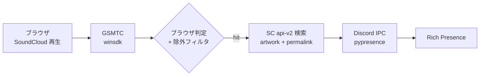

<div align="center">

# soundcloud-rpc

### Windows の SoundCloud 再生を Discord Rich Presence に表示する常駐スクリプト

[](#インストール)
[](#使い方)
[](LICENSE)

**ブラウザで SoundCloud を流すだけで、曲名・アーティスト・ジャケット・プログレスバー・曲ページのリンクが Discord に出る。**

---

</div>

## 概要

Windows のメディアセッション API (GSMTC) からブラウザの再生情報を取り、SoundCloud の Web API で曲のアートワークと曲ページ URL を引いて Discord Rich Presence に流す。Spotify と違って SoundCloud は Discord 公式の連携が無いのを埋めるためのもの。

## 特徴

| 機能 | 内容 |
|---|---|
| 曲名/アーティスト | GSMTC から取得 |
| ジャケット | SoundCloud CDN の 500x500 アートワークを URL 直渡し |
| プログレスバー | `last_updated_time` 基準で算出するのでポーリング遅延でズレない |
| 曲ページのリンク | `buttons` で曲の SoundCloud URL を貼る (※他人視点のみ表示) |
| ブラウザ判定 | AUMID にブラウザ名 (chrome/msedge/firefox/brave/opera/vivaldi) を含むセッションだけ採用 |
| 除外フィルタ | YouTube / Netflix / 広告 等をタイトルから弾く |
| 落ちにくさ | 例外はループ内で握り潰して継続。曲の切り替わり時だけ標準出力にログ |

## 処理フロー



## インストール

```powershell
git clone https://github.com/cUDGk/soundcloud-rpc.git
cd soundcloud-rpc
python -m pip install -r requirements.txt
```

## 使い方

1. [Discord Developer Portal](https://discord.com/developers/applications) で New Application して、`APPLICATION ID` をコピー
2. `sc_rpc.py` の `CLIENT_ID` をその ID に書き換える
3. アプリ名がそのまま Discord のステータス欄に出るので、アプリ名は `SoundCloud` 等にするのがおすすめ
4. (任意) Rich Presence > Art Assets に `soundcloud` という名前で SoundCloud ロゴをアップ。これは SC 検索でジャケットが見つからなかった時のフォールバック用
5. 起動

```powershell
python sc_rpc.py
```

ブラウザで SoundCloud を流すと曲情報が Discord に出る。止める時は `Ctrl+C`。

### 設定 (sc_rpc.py 冒頭)

| 変数 | 説明 |
|---|---|
| `CLIENT_ID` | Discord Application ID |
| `STRICT_MODE` | True ならブラウザ AUMID 限定。False で他アプリも対象 |
| `SC_APP_AUMID` | 指定するとそのアプリの AUMID 完全一致だけ採用 |
| `POLL_INTERVAL` | ポーリング間隔 (秒、既定 5) |
| `FALLBACK_IMAGE_KEY` | ジャケット取得失敗時に使う Art Asset 名 |

### デバッグ用

検出したセッションの中身を 1 回だけダンプする:

```powershell
python debug_session.py
```

## 既知の制約

- **Discord のボタン (曲リンク) は自分自身のアクティビティでは見えない仕様。** フレンドのプロフィール経由か別アカウントから見ると出る
- OS のメディアセッションはブラウザ全体で 1 つしか出ず、URL/ドメインの取得不可。タイトル/AUMID/除外ワードによる近似判定に頼る
- SoundCloud は公式 API の新規登録を 2021 から停止しているため、本ツールは Web 版 SC が読み込む JS から `client_id` を抽出して `api-v2.soundcloud.com` を叩く。Discord 連携が無い穴を埋めるための個人利用想定

## ライセンス

[MIT](LICENSE)
